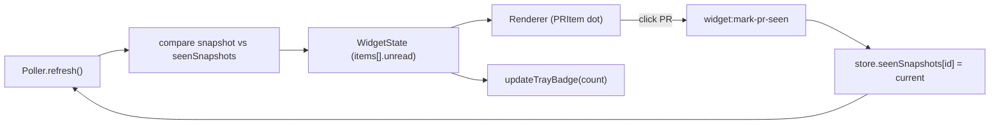

## What changes

Two largely-independent features that ship together:

1. **`menubar` window mode** — popover anchored under the tray icon, dismisses on blur, replaces the floating-panel positioning when active. Other modes (`desktop` / `floating` / `normal`) keep working exactly as today.
2. **Per-PR unread state with tray badge** — every PR with new activity becomes "unread" until the user clicks it; tray icon renders a red dot with count.

## 1. `menubar` window mode

### Type / config

- [src/shared/types.ts](src/shared/types.ts): extend `WindowMode = "desktop" | "floating" | "normal" | "menubar"`.
- [src/main/store.ts](src/main/store.ts): no schema change; existing `windowMode` field carries the new value.
- [src/renderer/components/SettingsPanel.tsx](src/renderer/components/SettingsPanel.tsx): add a fourth radio option `menubar` with hint "anchored to the menu-bar icon (macOS)". On non-darwin, render the option disabled.

### Window behavior — [src/main/window.ts](src/main/window.ts)

- New `applyMenubarWindowPreferences(window, tray)` that, when `windowMode === "menubar"`:
  - `setAlwaysOnTop(true, "pop-up-menu")` so it floats over fullscreen apps.
  - `setSkipTaskbar(true)`, `setMovable(false)`, `setResizable(false)`.
  - Hide on `blur` (popover semantics). Skip the blur-hide while DevTools or the settings panel is active to avoid surprise dismissal during dev.
  - Track an `isMenubarMode` flag so move/resize don't persist bounds (popover is auto-positioned).
- New `positionWindowUnderTray(window, tray)`:
  - Read `tray.getBounds()`; for `tray.getBounds()` returns `{x, y, width, height}` on macOS.
  - Use `screen.getDisplayMatching(trayBounds)` to clamp so the popover doesn't overflow the active display.
  - Set `window.setBounds({ x: trayBounds.x + trayBounds.width/2 - winWidth/2, y: trayBounds.y + trayBounds.height + 6, width, height })`.
  - Use a fixed compact size (e.g. `380 x 520`) when in menubar mode so it feels like a popover, independent of saved bounds.
- `applyWindowPreferences(window)` becomes `applyWindowPreferences(window, tray)` (tray now needed for positioning); the existing desktop/floating/normal branches stay intact and `setMovable(true)/setResizable(true)` are restored when leaving menubar mode.

### Tray click behavior — [src/main/window.ts](src/main/window.ts)

`tray.on("click", ...)` becomes mode-aware:

- In `menubar` mode: position under tray, then toggle visibility (`isVisible() ? hide() : showInactive()`); also call new `markAllAsSeen()` on show.
- In other modes: keep current `toggleWindowVisibility(window)` behavior.

### Bootstrap wiring — [src/main/index.ts](src/main/index.ts)

- Pass `tray` into `applyWindowPreferences` after both are created so the first paint can position correctly when the saved mode is `menubar`.
- On `widget:set-config`, after `applyWindowPreferences`, if mode is `menubar` re-show under tray; otherwise restore saved bounds.

## 2. Per-PR unread tracking + tray badge

### Type — [src/shared/types.ts](src/shared/types.ts)

```ts
export interface PullRequestItem {
  // ...existing fields
  unread: boolean;          // computed by main, read by renderer
  unreadReason?: "new" | "comments" | "commits" | "review" | "state";
}
```

### Persistence — [src/main/store.ts](src/main/store.ts)

Add a `seenSnapshots: Record<number, SeenSnapshot>` map keyed by PR id, where `SeenSnapshot` captures the state the user last saw:

```ts
interface SeenSnapshot {
  headSha: string;
  commitCount: number;
  commentCount: number;
  reviewCommentCount: number;
  lastReviewState: ReviewState;
  state: "open" | "closed" | "merged";
  draft: boolean;
  seenAt: string; // iso
}
```

New helpers: `getSeenSnapshots()`, `markPrSeen(id, snapshot)`, `markAllSeen(currentSnapshots: Map<number, StateSnapshot>)`, `pruneSeenSnapshots(activeIds)` to keep the store from growing unbounded.

### Compute unread — [src/main/poller.ts](src/main/poller.ts)

After `fetchWidgetState` resolves, before partitioning muted, decorate each `PullRequestItem` with `unread`/`unreadReason` by comparing the live `StateSnapshot` against the persisted `SeenSnapshot`:

- No `SeenSnapshot` yet AND first run → not unread (avoid flooding on first launch). On first run, seed `seenSnapshots` with the current snapshot.
- No `SeenSnapshot` AND not first run → `unread: true, reason: "new"`.
- `headSha` changed → `unread: true, reason: "commits"`.
- `commentCount + reviewCommentCount` increased → `reason: "comments"`.
- `lastReviewState` transitioned to `APPROVED` / `CHANGES_REQUESTED` → `reason: "review"`.
- `state` changed (closed / merged) or `draft → not draft` → `reason: "state"`.
- Muted PRs are never unread (badge ignores them).

### IPC — [src/main/index.ts](src/main/index.ts) + [src/preload/index.ts](src/preload/index.ts)

- `ipcMain.handle("widget:mark-pr-seen", (_e, id) => { markPrSeen(id, snapshotFor(id)); return poller.refresh(); })`
- `ipcMain.handle("widget:mark-all-seen", () => { markAllSeen(poller.getSnapshots()); return poller.refresh(); })`
- Expose both on `widgetApi` in [src/preload/index.ts](src/preload/index.ts).

### Tray badge — [src/main/window.ts](src/main/window.ts)

- Track the current unread count in main (derived from latest `WidgetState`). Add `updateTrayBadge(tray, count)`:
  - Compose the existing `traySvg` plus an overlaid red circle with the count when `count > 0`. Use `nativeImage.createFromBuffer` for a 16x16 + 32x32 (`@2x`) image. For `count > 9`, render `9+`.
  - Update `tray.setToolTip(\`PR Pulse — ${count} unread\`)`.
  - On macOS also call `app.dock?.setBadge(String(count))` only if dock is visible (currently hidden, so this is a no-op — leave it as a one-line guard).
- Subscribe to poller updates from [src/main/index.ts](src/main/index.ts) and call `updateTrayBadge(tray, unreadCount)` whenever state changes.

### Renderer — clear-on-click

- [src/renderer/lib/api.ts](src/renderer/lib/api.ts) + preload: add `markPrSeen(id)` / `markAllSeen()` thin wrappers.
- [src/renderer/components/PRItem.tsx](src/renderer/components/PRItem.tsx): when the card click handler fires, call `widgetApi.markPrSeen(item.id)` alongside `widgetApi.openPR(...)`. Render a small unread dot (e.g. `.unread-dot` matching neon-green theme) when `item.unread` is true.
- [src/renderer/App.tsx](src/renderer/App.tsx): no extra unread state needed (the flag lives on each item from main). Optional "mark all read" button in the meta bar that calls `widgetApi.markAllSeen()`.
- In `menubar` mode, opening the popover does NOT auto-clear (per the chosen unread model: per-PR, cleared on click).

## Data flow



## Out of scope

- Reordering unread items to the top (kept current sort by `updatedAt`).
- Sound on new unread.
- Windows menubar parity — `menubar` mode will be macOS-only; on Windows the option is disabled in settings and falls back to `normal` if persisted.
- Changing the existing OS-level `Notification` toast behavior (kept identical).